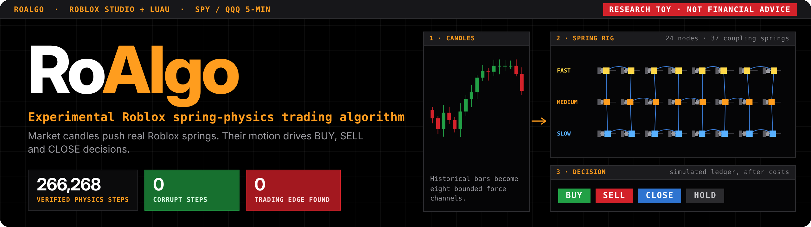

# RoAlgo

**An experimental Roblox spring-physics trading algorithm.** It is a rough proof of concept that uses the Roblox
engine itself, Luau code plus its native physics solver, as the computing substrate for a stock-market indicator.

**New here?** Start with the two-page [quick guide (PDF)](docs/roalgo-quick-guide.pdf).

Historical SPY/QQQ candles push networks of real Roblox physics objects: parts on rails, `SpringConstraint`s
and `VectorForce`s. Roblox's solver moves them, the code measures their positions and velocities, and those
measurements feed forecasts and BUY / SELL / CLOSE decisions. Everything runs in Roblox Studio (Edit mode) through
local plugins, with small Node.js helpers that serve cached data to Studio over localhost.

> **This is a research toy, not a trading system, and not financial advice.** Nothing here places orders. The only
> external connection is the optional download from Alpaca's read-only market-data API. None of the tests found a
> **trading edge** (see [Results](#results)).


## What's in the repository

The project went through four iterations in early October 2026. Each folder is self-contained, but later
versions import a few files from earlier ones, so keep the layout as it is.

| Folder | What it is |
|---|---|
| [`lab/`](lab/) | **v0, physical reservoir forecast lab.** A 24-node spring/rail network driven by market features. Modelling (ridge regression, Markov baseline, bootstrap evaluation) is pure Luau, shared between the Luau CLI and Studio; Studio only does the physics. Preregistered [protocol](runs/exp-20261005/protocol.json) and a sealed final test period. Runbook: [`docs/RUNBOOK.md`](docs/RUNBOOK.md). |
| [`indicator/`](indicator/) | **v1, first RoAlgo indicator.** Fast, medium and slow spring filters driven by five-minute candles, producing long/flat BUY / HOLD / SELL decisions in a Studio dashboard. |
| [`indicator-v2/`](indicator-v2/) | **v2, learned mechanics.** Coupled and independent 24-node rigs, a numerical twin, multi-timeframe inputs, a regime model, learned readouts, a long/short ledger and replay. [Explained at four levels](indicator-v2/EXPLAINED-FOUR-LEVELS.md). |
| [`indicator-v3/`](indicator-v3/) | **v3, Market Lab and Spring Indicator (latest).** The *Market Lab* adds sector and cross-market spring inputs, 24/48-node rigs, chronological folds and a zero-forecast baseline. It is implemented and probe-tested, but no completed real-data v3 Market Lab study exists. The *Spring Indicator* reads BUY / SELL / CLOSE decisions directly from spring states. It was run on 2024 and 2025-2026 data and has replay views. |
| [`tools/`](tools/) | Node orchestration, packaging, validation and a local bridge for the v0 lab. |
| [`docs/`](docs/) | Design plans, the lab runbook and [notes on `StepPhysics` behaviour](docs/stepping-capability.md). |
| repository root | Market-data downloaders, exporters and audits (`download*.mjs`, `prepare*.mjs`, `audit-supplement.mjs`). |

## Engine finding: verified stepping

In Studio 0.741 Edit mode, `WorldRoot:StepPhysics` is applied on a later frame and drops a share of requests
(about one in eight in the measurements here). Bursts of calls leave fractional sub-steps behind. Everything here
therefore steps physics with a *verified* protocol:

- Two large "metronome" parts ride along in every call.
- Only one request is outstanding at a time.
- Each step is confirmed to be exactly +1 dt.
- Dropped requests are re-issued.

Details and measurements: [`docs/stepping-capability.md`](docs/stepping-capability.md).

That note describes the first version of the protocol. One early v2 capture failed because a request that
completed late was counted as dropped (13 intervals where 12 were requested). The protocol was changed to wait
three frames before retrying and to check for late completions, and the run was redone from the start
([v2 verification](indicator-v2/VERIFICATION.md)). The completed runs total about 266,000 verified steps (171,660 +
27,216 + 67,392 below) with zero corrupt steps.

## Results

Short version: the physics really computes, and decisions measurably depend on the spring states. But no model beat
a "no change" forecast or "no trade" by a meaningful margin. In three exploratory v0 comparisons, the physics
features made forecasts measurably worse.

| Experiment | Outcome |
|---|---|
| v0 lab, preregistered 8-hour forecasts, final period 2025-01-01 to 2026-10-02 | Primary comparison (raw + physics minus raw-only ridge, normalized RMSE): **+0.0040, 95% CI [-0.0001, +0.0093]**, so physics did not help. Every model was within about 1% of a "no change" forecast. 171,660 verified native steps, 0 corrupt. [Report](runs/exp-20261005/report.md) |
| v1, five sessions in Dec 2024 | SPY -0.69%, QQQ -0.55% after costs (numerical control -0.95% / -1.50%). [Verification](indicator/VERIFICATION.md) |
| v2 learned readout, 5 evaluation sessions in Dec 2024 | Physics variants -0.73% vs raw inputs +0.64%. A later check found the full-context readouts were far worse than a zero forecast: a near-constant regime input exploded under standardization. So this comparison is not meaningful. |
| v3 repaired readout (same saved v2 states) | Every model still loses to the zero forecast on validation, so every comparison chooses `no_trade`. [Details](indicator-v3/README.md#current-saved-state-result) |
| Spring Indicator, 10 post-training sessions, Dec 17-31 2024 | Coupled springs **-2.58%**, independent -1.74%, numerical springs -1.63%, EMA baseline -2.25%, no-trade 0% (after costs). These were already-inspected sessions, decided by an offline Luau run on the saved v2 native states. [Report](indicator-v3/spring-indicator-report.md) |
| Spring Indicator on 2025-01-02 to 2026-10-02 | 34,134 historical five-minute bars, replayed bar by bar with physics and decisions computed inside Studio. Out-of-sample for this indicator only, since the same period was the v0 lab's final test. Coupled **-56.1%**, independent -57.4%, numerical springs -54.1%, EMA -67.1%, no-trade 0%. The predeclared edge criterion failed. 67,392 verified native steps, 0 corrupt. [Audit](indicator-v3/spring-live-launch-audit-20261005.md) |

Returns are simulated under each experiment's declared cost model, not broker fills.

## Requirements

- **Roblox Studio** (developed on 0.741), Edit mode, local plugins. The installers fetch source from the local
  bridge over HTTP, so allow HTTP requests when Studio asks: the plugin shows a permission prompt, and for the
  Command Bar route you may need to enable `HttpService.HttpEnabled` in your place.
- **Luau CLI 0.741** for the offline tests: put `luau` on your `PATH` or set `LUAU_EXE` to the binary. If your
  install folder is not named `luau-0.741`, set `LUAU_VERSION=0.741` for the run records.
- **Node.js 24** (no npm dependencies). The Windows `Start-RoAlgo.ps1` launchers assume Node's default install path.
- **Market data is not included.** The downloaders use the [Alpaca market-data API](https://docs.alpaca.markets/)
  and need your own Alpaca API key; check that your plan includes the historical data you request. **Alpaca does not
  allow redistribution of data obtained through its API.** Do not commit, publish or share the downloaded bars or
  anything generated from them row by row: `data/`, `results/`, `runs/`, state caches, or a lab plugin built with
  `tools/build-plugin.mjs`, which embeds your downloaded bars. These paths are git-ignored.
- The v0 lab's runbook drives Studio through the Roblox Studio MCP server; the same snippets can be run from the
  Command Bar. v1-v3 install through their plugin or the Command Bar.

### Studio place

The Studio-side code checks `game.PlaceId` before it does anything. In this release the expected value is
**PlaceId 0**, which is what Studio reports for **every unpublished place file**. The plugins therefore start in
any unpublished place you open; use a dedicated place file for this project. To restrict them to a published or
Team Create place, replace the `0` in every place check with your PlaceId. The checks are written in several styles,
so search case-insensitively, for example `grep -rni placeid .`.

## Getting the data

From the repository root, with a local text file that contains only your Alpaca key ID and secret (keep it outside
the repository):

```sh
node download.mjs <credentials-file> data/alpaca-2021-10-04_2026-10-02
node prepare.mjs data/alpaca-2021-10-04_2026-10-02
node download-supplement.mjs <credentials-file> data/alpaca-supplement-2016-01-01_2026-10-02
node prepare-supplement.mjs data/alpaca-supplement-2016-01-01_2026-10-02
node audit-supplement.mjs data/alpaca-supplement-2016-01-01_2026-10-02
node indicator-v3/fetch-sector-context.mjs <credentials-file>    # v3 only: XLK/XLF/XLE hourly context
node tools/prepare-lab.mjs                                       # v0 lab: regenerates lab/generated/ from your data
```

The bridges and tools expect exactly these folder names. The date ranges are fixed in the scripts (the original
study ended on 2026-10-02). Credentials are only sent as headers to Alpaca's fixed market-data endpoint and are
never written to disk or logs. More detail: [`SUPPLEMENT.md`](SUPPLEMENT.md).

## Running the latest version (v3)

```sh
node indicator-v3/package.mjs        # builds indicator-v3/build/RoAlgoMarketLab.plugin.rbxmx
node indicator-v3/bridge.mjs         # local data bridge on 127.0.0.1:47624 (Windows: Start-RoAlgo.ps1)
```

Copy the plugin artifact to `%LOCALAPPDATA%/Roblox/Plugins/RoAlgoMarketLab.rbxmx`, or run
`indicator-v3/Install-In-Studio.luau` from the Studio Command Bar. Then open your place in Edit mode; the plugin
button toggles the dashboard. Controls, saved-result formats and data conventions are in
[`indicator-v3/README.md`](indicator-v3/README.md).

**Spring Indicator.** The code lives in:

- `indicator-v3/src/Spring*.luau`, the in-Studio modules: signals, policy, live session and capture, replay views and panel;
- `run-spring-indicator.mjs` (the offline 2024 run);
- `spring-live-server.mjs`, a raw-candle server on 127.0.0.1:47627;
- `Install-SpringLive-In-Studio.luau`.

The procedure is specified in [`spring-indicator-contract.md`](indicator-v3/spring-indicator-contract.md),
[`spring-live-contract.md`](indicator-v3/spring-live-contract.md) and the
[2025-2026 test plan](indicator-v3/forward-test-2025-2026-plan.md). It cannot be rerun as-is from this repository.
It is pinned to the original saved v2 capture (not included) and refuses data whose hashes differ. Earlier versions
have their own READMEs, and the v0 lab has [`docs/RUNBOOK.md`](docs/RUNBOOK.md).

## Tests

```sh
npm test               # Node tests that need no market data (141 tests; needs the Luau CLI)
npm run test:luau      # every Luau spec (37 files, including the 208-test v0 lab suite)
```

Neither command needs Studio or market data. One Luau spec skips its 5 real-session tests unless you provide its
optional data-derived fixture.

`npm run test:all` runs every Node test file. Many of the extra tests check the original downloaded data and saved
native-state results by exact hash. Those files are not included because they contain market data. Those tests can
only pass with the original private files; re-downloading or re-capturing produces different bytes. Native physics
itself can only be verified inside Studio (see each version's `EngineProbe` / `AppProbe`).

## Provenance and what was changed for release

The reports, contracts and evidence files record SHA-256 hashes of source files and saved results from the
original runs. Preparing this release edited 95 of the 337 copied files:

- **Substitutions:**
  - local paths became `LUAU_EXE`/`PATH` lookups or repository-relative paths;
  - the original place ID became `0`;
  - the owner's name became "the owner";
  - internal tool and session identifiers were removed.
- **Small fixes to make it run elsewhere:**
  - a PATH-aware Luau resolver;
  - one spec now skips when its private fixture is absent;
  - the calendar test fixture uses synthetic instants instead of instants sampled from market data;
  - two generated audit files that listed real trading-hour timestamps were removed.

Because of these edits, recorded hashes no longer match several files. These include the 2025-2026 test plan and
`spring-live-contract.md` (see `forward-test-2025-2026-plan.sha256`), and the `SpringStudy` / `SpringLiveCapture`
pins in the launch audit. Treat the reports as records of what was run, not as artifacts you can re-verify byte for
byte from this repository.

Most of the code and documents were written by AI coding agents (Claude Code and OpenAI Codex) under the
author's direction, with independent agent reviews. Treat it as experimental code.

## License

[MIT](LICENSE) covers this project's code and documents. Market data you download is not covered and remains
subject to your data provider's terms. The screenshots show Roblox Studio scenes, including Roblox default assets,
which remain Roblox's property.
