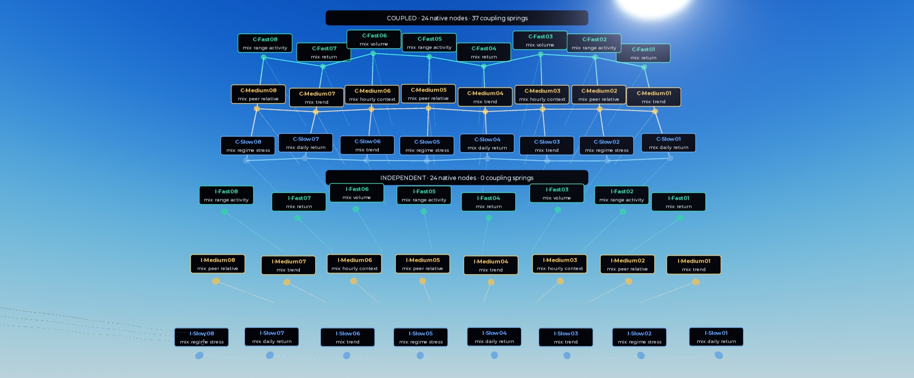
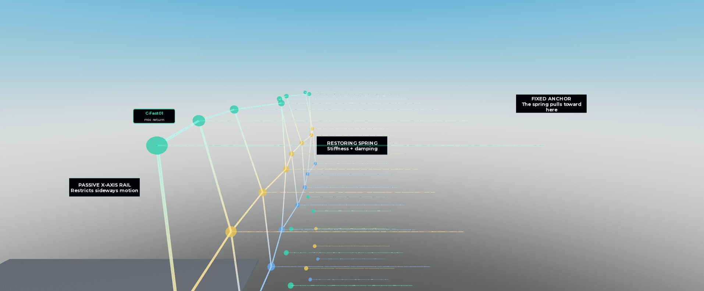
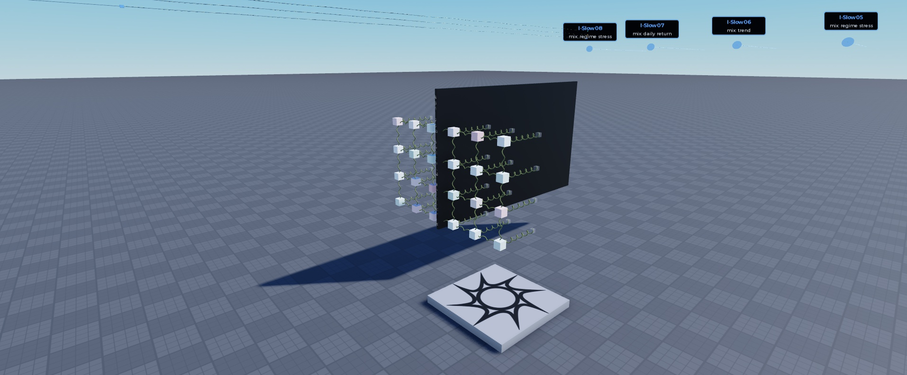

# How RoAlgo uses Roblox physics to produce trading signals

RoAlgo feeds historical market observations into real Roblox spring systems, measures their motion, and trains a mathematical readout to produce forecasts. Trading rules then turn those forecasts into BUY, SELL, HOLD and CLOSE signals. This guide explains the visible parts and the same system at four levels of technical detail.

The implementation works as a research instrument. The completed experiment did **not** show that adding physics improved trading performance. Its distinctive feature is using Roblox as part of the computation; the present results do not establish new financial mathematics or a profitable strategy.

## What the visible parts do

*The active 48 nodes: the upper grid is coupled and the lower grid is independent. Each has Fast, Medium and Slow rows of eight nodes.*

| Visible component | Its job |
|---|---|
| Colored node | A real unanchored body whose displacement and velocity become model inputs. The larger sphere is a decorative marker following that body. |
| Small restoring spring behind a node | Connects the node to an anchored part, pulls it toward its rest position and damps its motion. |
| Anchor and rail | The anchor provides a fixed reference. A passive prismatic constraint restricts motion to the world X axis. |
| Connections across the upper grid | Thirty-seven coupling springs let neighboring nodes influence one another. Their enlarged beams make the connections easier to see. |
| Lower grid without cross-connections | A comparison with the same 24 node designs and inputs, retaining restoring springs but removing coupling springs. |
| Fast, Medium and Slow rows | Different mechanical response rates, with slightly different parameters within each row. |
| Floating node names | Identify the measured node and its input mixture. A node is not a separate complete trading indicator. |

*The native body, restoring spring, anchor and rail perform the mechanical work. Larger markers and beams improve visibility without changing mass, stiffness or damping.*

The two v2 images above show the restored presentation pose from the completed historical run, not a live market feed. The final floating labels use `AlwaysOnTop` and no distance fade. For the MCP screenshot world-render pass, their rendering mode was temporarily changed so they appeared in the capture; the live label setting was restored afterward.

*Historical reference: `MarketReservoirLabReplay` was a recorded experiment replay with 62 springs. It and both earlier three-spring `RoAlgoIndicatorPhysics` copies were removed from the current scene at your request. Each three-spring copy contained Fast, Medium and Slow nodes; these legacy models were separate from the active v2 computation.*

The replay's small `Node01` and subsequent bodies were anchored and illustrated stored results. The v2 model did not run through those little springs. The active v2 rigs remain, along with their two invisible falling cubes that verify physics timing; those cubes are measuring instruments, not forecasting nodes.

## Level 1 Random Roblox player

Imagine making a machine that remembers how you have been pushing it. Push a spring once and it moves, slows down and returns. Push it repeatedly and its current movement depends on both the latest push and earlier pushes.

RoAlgo turns stock-market information into those pushes. Recent price movement, trading activity and broader market conditions all contribute. Some nodes respond quickly; others retain a slower response. Connections in the upper grid also let one node affect its neighbors.

The program measures the machine, then a trained mathematical model combines those measurements with the original market information. It estimates a short future stretch of price movement. The machine itself does not know what a stock is, and a spring leaning one way does not automatically mean BUY.

The trading rules use the estimate to decide whether to open a long position with BUY, open a short position with SELL, keep waiting with HOLD, or exit an existing position with CLOSE. These are simulated historical trades; this app does not send brokerage orders.

The lower machine helps answer a useful question: do the connections actually help? Another comparison skips the springs and uses market information directly. In the completed test, that direct model performed better. We have shown that Roblox can do this calculation, but we have not shown that it beats ordinary forecasting methods.

## Level 2 Roblox dev

The controller constructs two matched rigs. Each node is an unanchored `Part`, a passive `PrismaticConstraint`, an axial `SpringConstraint` and a `VectorForce`. Anchors stay fixed, forces act along world X, and parts do not collide. Roblox calculates the resulting motion. The coupled rig adds 37 node-to-node springs; the independent rig omits those links.

Luau builds 33 market features and eight bounded drive channels. A fixed projection mixes the channels differently for each node. Fast nodes emphasize immediate returns, range and activity; Medium nodes emphasize trend, peer movement and hourly context; Slow nodes emphasize daily returns, regime stress and trend. Each node also receives smaller signed contributions from other channels.

For every five-minute market observation, the input stays constant for twelve verified native steps of 1/60 second. That is **0.2 simulated seconds per market bar**. This controlled Studio Edit-mode process does not use a player's variable frame rate as its clock. The two falling metronomes check that requested physics intervals actually completed.

The readout captures 24 normalized displacements and 24 normalized velocities. Luau calculates three row energies from those measurements, producing **51 mechanical features**. Adding the 33 direct features gives an 84-input forecasting model. Displayed forces and energies are calculated from the mechanical model; displacement and velocity originate in native bodies.

A numerical coupled simulation runs alongside the native rigs using RK4 integration of the modeled equations. This separates questions about the mechanical design from differences in Roblox's solver. Recorded replay displays saved states and trades without adding native steps.

Training changes the forecasting weights. It does not tune the springs, topology or input projection. Whole-rig translation preserves the intended mechanics when cached rest positions are updated consistently; changing internal geometry would change the model. See [Engine](src/Engine.luau), [Mechanics](src/Mechanics.luau) and [VerifiedStepper](src/VerifiedStepper.luau).

## Level 3 Finance grad with Roblox deving experience

This is a mechanical reservoir used to generate features. A fixed dynamical system turns a sequence of market inputs into a state with memory; a fitted regression translates that state into predictions.

The eight mechanical drives are recent EWMA trend, immediate close-to-close return, candle range adjusted by trade-count activity, log-volume deviation, target-versus-peer candle return, average completed SPY/QQQ/IWM/TLT hourly return, completed target daily return, and high-minus-low volatility-regime probability. Causal running scales normalize the first seven, and all eight are bounded between −2 and 2.

The 33 direct predictors retain additional detail, including VWAP deviation, time of day, missing-data flags and overnight indicators. The reservoir transforms this available information; it does not introduce new market information.

A three-state diagonal-Gaussian hidden Markov model supplies regime probabilities. It is fitted on earlier daily log returns and log fractional ranges. Its states are ordered by estimated daily range, so low, medium and high refer to volatility rather than automatically meaning bull, sideways and bear. Parameters remain fixed after fitting; newly completed daily observations update the forward probabilities.

The supervised readout has three ridge-regression heads. They estimate gross return, maximum upside and maximum downside over the next **six five-minute bars**, beginning at the next open and ending at the sixth future close. The two excursion estimates are currently diagnostics: they do not determine stops or position size.

With default costs, the return forecast must exceed +5 basis points for a long entry or fall below −5 basis points for a short entry. Signals formed at a completed bar execute at the next observed open. Existing positions can close after a forecast sign change, a holding timeout, or a stop or target hit.

The experiment uses 20 training sessions, five validation sessions and five evaluation sessions. Standardization uses training samples only; validation selects the ridge penalty. Labels crossing a session, a missing intraday interval or a split cutoff are rejected. Hourly and daily contexts must already be available at the decision time. These safeguards address future-data leakage within the run, but previously inspected dates are not an untouched research holdout. See [Features](src/Features.luau), [Regime](src/Regime.luau), [Learning](src/Learning.luau) and [Execution](src/Execution.luau).

## Level 4 Quant analyst at JPMorgan

The proposal is a fixed nonlinear dynamical feature map followed by regularized supervised readouts. For node i, the modeled equation is approximately:

`mᵢ ẍᵢ + cᵢ ẋᵢ + kᵢ xᵢ = kᵢ D (P uₜ)ᵢ + Σⱼ Fᵢⱼ`

Here D is 64 studs, P is the fixed input projection and the coupling force depends on relative displacement and velocity. Local restoring terms are linear; changing coupling-spring lengths introduce geometric nonlinearity. The state vector combines normalized displacement, normalized velocity and three bank energies with direct predictors.

Three ridge heads use training-only scaling. Validation return MSE selects a penalty from 0.1, 1 and 10, shared across the three heads. The return target is next-open to sixth-future-close gross return. Excursion predictions are clamped nonnegative. The displayed score divides mean return by predicted upside plus downside; it is not a calibrated probability.

Execution allows one position with equity-sized entry notional, no pyramiding and no volatility-targeted sizing. Defaults are one basis point each for fee and adverse slippage per side, plus 3% annualized short borrow. Stop distance is max(10 bp, twice the EWMA return RMS); target distance is max(10 bp, three times that RMS). The maximum hold is 24 observed bars. OHLC ambiguity uses stop first, adverse stop gaps use the open, and final exposure is marked without inventing an exit.

The completed capture contains 2,268 SPY five-minute bars from November 18 through December 31, 2024. There are 1,393 mature training labels, 360 validation labels and 354 evaluation bars. The HMM initially uses 2,234 prior daily bars, yielding 2,233 observations. Native capture verified 27,216 intervals.

| Model | Predictors | Net return | Maximum drawdown | Closed trades |
|---|---:|---:|---:|---:|
| Coupled native | 84 | −0.7263% | 2.5145% | 35 |
| Independent native | 84 | −0.7263% | 2.5145% | 35 |
| Numerical coupled | 84 | −0.7263% | 2.5145% | 35 |
| Full raw features | 33 | +0.6374% | 2.5145% | 33 |
| Reduced raw features | 16 | −0.4326% | 1.7373% | 18 |

These returns cover the same five evaluation sessions, December 24–31. Mechanical variants have distinct weights and forecasts, but crossed the same decision thresholds and produced identical fills. Each finished with a marked short position. Both raw variants finished flat. The full raw model's final SELL had no subsequent bar on which to fill.

This sample supplies **no demonstrated incremental alpha from mechanical features**. Five previously inspected sessions, overlapping labels, fixed transaction costs, raw price adjustments and potentially extended-hours hourly context constrain interpretation. There is no independent deployment period or broad regime-robustness evidence here. A positive raw baseline return in this sample does not establish profitability either.

More cached data is available than this run used: five-minute targets begin in October 2021 and daily context reaches back to 2016. Availability is not training coverage. The present contribution is an auditable implementation and a comparison framework; the financial benefit remains an empirical question. Exact provenance, execution assumptions and independently reconstructed results are documented in [Verification](VERIFICATION.md), [Data report](data-report.md) and [Final audit](final-audit.md).
